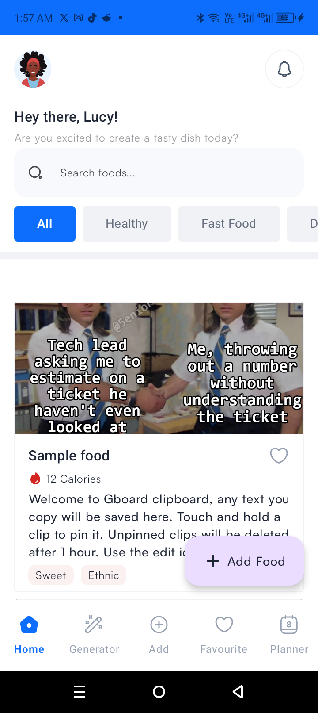
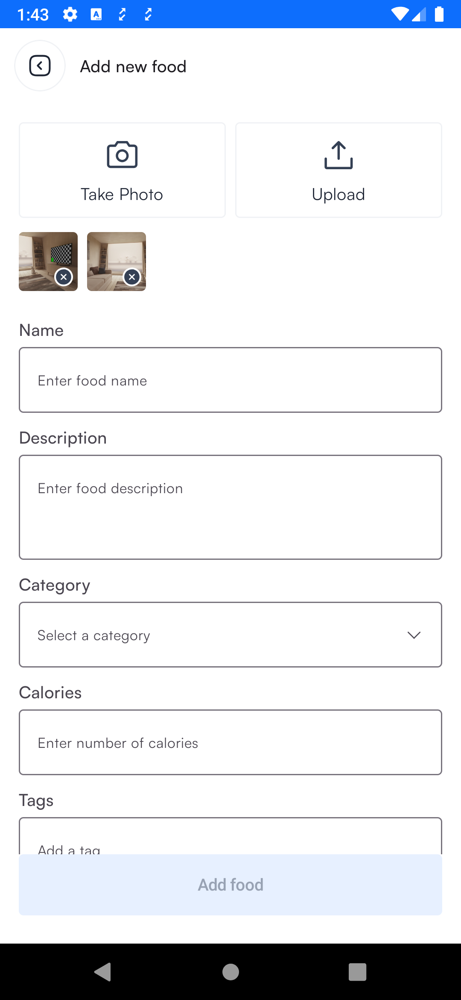

# Voyatek Food App
An android app that displayes list of meals. There's is a functionality for adding meals and images.

## Languages, libraries and tools used
* Kotlin
* Jetpack compose
* Coil - image loading
* Hilt - dependency injection
* Retrofit
* KotlinX serializer

## How to run the project
* Download the latest android studio
* Clone the project from github using this command `git clone https://github.com/segunfrancis/Voyatek-food-app.git`
* Open the project in android studio
* Run the project on an emulator or a physical device

## Architecture
* This project makes use of MVVM architecture.
* The **data layer** is responsible communicating with the rest API.
* Endpoints:
  * `api/foods`: A GET request that returns a list of food
  * `api/categories`: A GET request that returns a list of the categories. This is useful when saving a food to the server
  * `api/tags`: A GET request that returns a list of tags. There can be more than one tag for each food
  * `api/foods`: A POST request that handles saving of a particular food to the server
* The **ViewModel** handles the UI logic
* The **Composables** render the UI

## Screenshots

  
  

